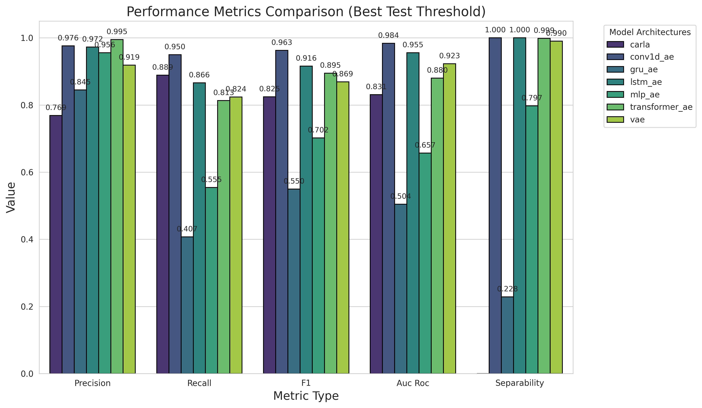
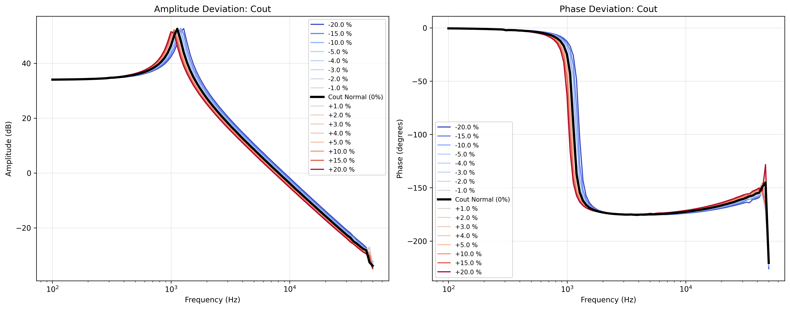
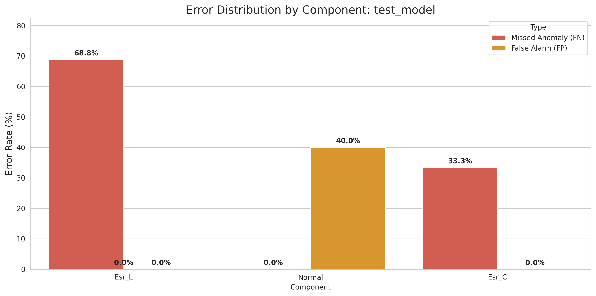

## 1. Introduction

Power electronic converters are critical infrastructure components across numerous modern applications. The modern power grid itself is actively transitioning towards a Power Electronics-Dominated Grid (PEDG) due to the massive integration of renewable energy sources and energy storage systems [6]. While beneficial, this shift introduces severe complexities in grid operation, making system stability and security paramount. 

Faults in these converters can cause severe system failures, safety hazards, and significant economic losses. Traditional condition monitoring methods often rely on manual inspection or simplistic threshold alarms, which fail to detect the subtle, non-linear degradation patterns that precede catastrophic failure. Consequently, the timely and accurate detection of anomalies is becoming increasingly critical for maintaining complex production systems and mitigating potential infrastructure degradation [7].

Data-driven anomaly detection using deep learning offers a powerful alternative by analyzing the transfer functions (Bode plots) as signatures of system health. By modeling the complex interdependencies of components (e.g., capacitor aging, MOSFET wear, equivalent series resistance changes), machine learning algorithms can predict faults earlier and with higher sensitivity. However, data-driven approaches in power electronics face two primary hurdles:
1. **Uncertainty in Datasets**: Real-world power datasets often suffer from high uncertainty and limited diversity compared to lab environments [7], requiring robust ML techniques.
2. **Computational Bottlenecks**: Executing complex sequence models requires significant computational power, posing a substantial challenge for real-time inference on resource-constrained edge devices typically deployed alongside physical converters [10]. 

This paper introduces a modular, high-performance deep learning framework designed to solve these exact problems. By combining advanced self-supervised contrastive learning (CARLA) with rigorous TensorRT acceleration, we deliver a framework that is both highly sensitive to subtle degradation and computationally efficient enough for real-time edge processing.

## 2. Dataset Generation and Characteristics

To train and evaluate the deep learning models without the prohibitive cost of physical destructive testing, we utilized PSIM (Power Electronics Simulation) to generate a high-fidelity dataset, acting effectively as a digital twin for the hardware environment [6]. 

The dataset captures the transfer function, defined as:
$$ H(s) = \frac{V_{out}(s)}{V_{in}(s)} $$
of a Buck Converter across a frequency range of $100\text{ Hz}$ to $50\text{ kHz}$, sampled logarithmically at $101$ points. Each frequency point is characterized by its Amplitude (dB) and Phase (degrees). 

We systematically simulated continuous parametric variations of critical components:
- Output Capacitor ($C_{out}$)
- Inductor ($L$)
- MOSFET On-Resistances ($R_{ds,1}, R_{ds,2}$)
- Equivalent Series Resistances ($ESR_C, ESR_L$)

**Labeling Strategy**:
- **Normal State**: Parameter variations within a $[-5\%, +5\%]$ range (swept at a $1\%$ step resolution).
- **Anomalous State**: Parameter deviations in the ranges of $[-20\%, -5\%)$ and $(+5\%, +20\%]$ (swept at a $5\%$ step resolution).

This physics-aware simulation pipeline generated a vast dataset of $227,698$ unique frequency response transfer functions, split into $70\%$ training, $15\%$ validation, and $15\%$ testing sets.

## 3. Modular Deep Learning Framework

Our codebase implements a unified `BaseAutoencoder` API to maintain strict separation of concerns, allowing for rapid experimentation across different model architectures.

### 3.1 Model Architectures
We benchmarked six distinct neural architectures:
1. **Conv1D-AE**: Utilizes 1D convolutions to capture local frequency resonance patterns efficiently. 1D CNNs have achieved state-of-the-art performance in engineering time-series tasks. A major advantage of this topology is that real-time and low-cost hardware implementation is highly feasible due to its compact configuration [8].
2. **LSTM-AE & GRU-AE**: Recurrent architectures optimized for sequence modeling and gradual drift detection.
3. **Variational Autoencoder (VAE)**: Models the latent space probabilistically using KL-divergence for smoother representations [2].
4. **Transformer-AE**: Employs multi-head self-attention to capture long-range global dependencies across the entire frequency spectrum [3].

### 3.2 Self-Supervised Contrastive Learning (CARLA)
Standard autoencoders are limited because they only learn to reconstruct normal data. To enhance sensitivity, we integrated the CARLA (Contrastive Representation Learning for Anomaly Detection) methodology [1]. 

A known challenge in applying contrastive learning to time-series anomaly detection is the *representation collapse* issue, where the encoder converges to a constant solution if negative samples are drawn directly from the dataset (where most samples are "normal") [9]. CARLA explicitly circumvents this by generating synthetically anomalous samples (negative samples) computationally during training. We inject physics-matching anomalies:
- **Domain-Specific**: Resonance shifts, amplitude scaling, phase distortions.
- **Sequence Anomalies**: Spectral noise injection, global drift, time warping.
- **Point Anomalies**: Signal spikes and point dropouts.

These are optimized using the Normalized Temperature-scaled Cross Entropy (NT-Xent) loss [4], forcing the projection head to maximally separate healthy and degraded states in the latent space without risking collapse:
$$ \mathcal{L}_{NT-Xent} = -\log \frac{\exp(\text{sim}(z_i, z_j) / \tau)}{\sum_{k=1}^{2N} \mathbb{1}_{[k \neq i]} \exp(\text{sim}(z_i, z_k) / \tau)} $$

### 3.3 Anomaly Scoring
During inference, anomaly scoring is conducted non-parametrically using a $k$-Nearest Neighbors ($k$-NN) density and distance estimator over the optimized projection space. This provides a robust, threshold-independent scoring mechanism (evaluated primarily via ROC-AUC).

## 4. High-Performance Edge Compute Deployment

Translating methods that work well in controlled lab environments to field applications presents massive engineering challenges, largely due to edge computing hardware limits [10]. A central contribution of this work is bridging the gap between theoretical model accuracy and these practical constraints. We benchmarked the deployment of our models across multiple formats (Keras, TFLite, ONNX, TensorRT) targeting NVIDIA edge accelerators. 

### 4.1 Hardware Resource Profiling

Table 1 details the resource consumption and latency distribution across different optimization strategies for the Conv1D architecture. 

\begin{table}[h!]
\centering
\caption{Hardware Resource Profiling across Deployment Formats}
\begin{tabular}{lcccc}
\toprule
\textbf{Model Format} & \textbf{Mean Latency (ms)} & \textbf{Min / Max Latency (ms)} & \textbf{Peak RAM (MB)} & \textbf{Peak VRAM (MB)} \\
\midrule
Keras FP32 (Baseline) & $20.870 \pm 2.132$ & $17.80 / 30.77$ & $4190.67$ & $2.69$ \\
TFLite FP16 & $0.182 \pm 0.076$ & $0.14 / 0.56$ & $4192.79$ & $2.69$ \\
TFLite INT8 & $0.133 \pm 0.040$ & $0.11 / 0.32$ & $4193.52$ & $2.69$ \\
ONNX (CPU) & $0.417 \pm 0.105$ & $0.36 / 1.08$ & $4196.14$ & $2.69$ \\
TensorRT FP32 (GPU) & $0.937 \pm 0.414$ & $0.45 / 2.04$ & $4201.77$ & $2.69$ \\
TensorRT FP16 (GPU) & $0.659 \pm 0.351$ & $0.40 / 2.01$ & $4202.64$ & $2.69$ \\
TensorRT INT8 (GPU) & $0.753 \pm 0.423$ & $0.38 / 2.52$ & $4203.27$ & $2.69$ \\
\bottomrule
\end{tabular}
\end{table}

The TensorRT optimizations achieved massive reductions in mean latency compared to the Keras baseline (from $\approx 20.8\text{ ms}$ down to $\approx 0.7\text{ ms}$), making the models strictly viable for high-frequency control loop integration on the edge.

### 4.2 Batch Size Scaling Dynamics

To understand throughput limits for multi-sensor edge gateways, we profiled batch scaling dynamics.

\begin{table}[h!]
\centering
\caption{Batch Size Latency Scaling for TensorRT (GPU) vs Baseline Keras}
\begin{tabular}{ccccc}
\toprule
\textbf{Batch Size} & \textbf{Keras Batch (ms)} & \textbf{Keras Sample (ms)} & \textbf{TensorRT Batch (ms)} & \textbf{TensorRT Sample (ms)} \\
\midrule
1 & $21.73$ & $21.732$ & $0.94$ & $0.939$ \\
16 & $22.76$ & $1.422$ & $0.99$ & $0.062$ \\
64 & $20.86$ & $0.326$ & $1.07$ & $0.017$ \\
128 & $22.20$ & $0.173$ & $1.62$ & $0.013$ \\
\bottomrule
\end{tabular}
\end{table}

TensorRT demonstrates exceptional scalability; processing a batch of $128$ samples takes only $1.62\text{ ms}$ ($0.013\text{ ms}$ per sample), highlighting its efficiency for parallelized multi-converter monitoring.

## 5. Experimental Results and Discussion

### 5.1 Classification Fidelity and Quantization Degradation

High-performance optimizations often come at the cost of model accuracy, especially when utilizing lower precision formats like INT8. 

\begin{table}[h!]
\centering
\caption{Classification Degradation Evaluation}
\begin{tabular}{lcccccc}
\toprule
\textbf{Model Format} & \textbf{Size (MB)} & \textbf{Accuracy} & \textbf{Precision} & \textbf{Recall} & \textbf{F1-Score} & \textbf{AUC-ROC} \\
\midrule
Keras FP32 (Baseline) & $3.42$ & $0.9555$ & $0.9702$ & $0.9597$ & $0.9649$ & $0.9851$ \\
TFLite FP16 & $0.57$ & $0.9576$ & $0.9731$ & $0.9599$ & $0.9665$ & $0.9854$ \\
ONNX (CPU) & $1.12$ & $0.9600$ & $0.9801$ & $0.9568$ & $0.9683$ & $0.9861$ \\
TFLite INT8 & $0.38$ & $0.6371$ & $0.6371$ & $1.0000$ & $0.7783$ & $0.3213$ \\
\bottomrule
\end{tabular}
\end{table}

Our evaluation shows that while TFLite INT8 suffers catastrophic degradation (AUC dropping from $0.985$ to $0.321$), half-precision (FP16) via TFLite or TensorRT maintains near-perfect parity with the FP32 baseline while cutting the model size from $3.4\text{MB}$ to $\approx 0.58\text{MB}$. The CARLA-Conv1D architecture proved to be the optimal trade-off, balancing the high ROC-AUC of contrastive learning with the fast $\mathcal{O}(N)$ computational complexity of 1D convolutions.

### 5.2 Single-Component Analysis

Using our visualization studio (analyzing 5 varying components: $ESR_C, ESR_L, R_{ds,1}, R_{ds,2}, C_{out}$), the deep learning models successfully partitioned the multi-component degradation profiles. The projection space clearly mapped the boundary between healthy states and anomalous states, demonstrating high sensitivity to the resonance shifts caused by output capacitor degradation.

Furthermore, the test error breakdown across different variation magnitudes confirms that the models exhibit robust generalization even at edge-case bounds.

## 6. Conclusion and Future Work

We have demonstrated a comprehensive, modular framework that leverages self-supervised deep learning (CARLA) for non-invasive fault diagnosis in power electronic converters. By integrating NVIDIA TensorRT, we achieved real-time inference latencies below $1\text{ ms}$, proving that advanced contrastive learning methodologies can be deployed effectively on constrained edge hardware.

Future research directions include:
1. **State Space Models (Mamba)**: Implementing linear complexity sequence models to replace Transformers, targeting an 8x speedup.
2. **Physics-Informed Neural Networks (PINNs)**: Embedding the buck converter differential equations directly into the contrastive loss function to improve generalization with less synthetic data.
3. **Kolmogorov-Arnold Networks (KAN)**: Exploring symbolic equation extraction for greater model interpretability.

---

## 7. References

[1] S. Darban, G. A. A. C. V. S. B. P. A., “CARLA: Self-supervised Contrastive Representation Learning for Time Series Anomaly Detection,” *arXiv preprint arXiv:2308.09296*, 2023.

[2] D. P. Kingma and M. Welling, “Auto-Encoding Variational Bayes,” *arXiv preprint arXiv:1312.6114*, 2013.

[3] A. Vaswani, N. Shazeer, N. Parmar, J. Uszkoreit, L. Jones, A. N. Gomez, L. Kaiser, and I. Polosukhin, “Attention is all you need,” in *Advances in Neural Information Processing Systems*, pp. 5998–6008, 2017.

[4] T. Chen, S. Kornblith, M. Norouzi, and G. Hinton, “A Simple Framework for Contrastive Learning of Visual Representations,” *arXiv preprint arXiv:2002.05709*, 2020.

[5] C. Liu, L. Kou, G. Cai, Z. Zhao, and Z. Zhang, “Review for AI-based Open-Circuit Faults Diagnosis Methods in Power Electronics Converters,” *arXiv preprint arXiv:2209.14058*, 2022.

[6] I. N. Idrisov, D. Okeke, A. Albaseer, M. Abdallah, and F. M. Ibanez, “Leveraging Digital Twin and Machine Learning Techniques for Anomaly Detection in Power Electronics Dominated Grid,” *arXiv preprint arXiv:2501.13474*, 2025.

[7] A. Beattie, P. Mulinka, S. Sahoo, I. T. Christou, C. Kalalas, D. Gutierrez-Rojas, and P. H. J. Nardelli, “A Robust and Explainable Data-Driven Anomaly Detection Approach For Power Electronics,” *arXiv preprint arXiv:2209.11427*, 2022.

[8] S. Kiranyaz, O. Avci, O. Abdeljaber, T. Ince, M. Gabbouj, and D. J. Inman, “1D Convolutional Neural Networks and Applications: A Survey,” *arXiv preprint arXiv:1905.03554*, 2019.

[9] K. Chen, M. Feng, and T. S. Wirjanto, “Harnessing Contrastive Learning and Neural Transformation for Time Series Anomaly Detection,” *arXiv preprint arXiv:2304.07898*, 2023.

[10] P. I. Gomez, M. E. Lopez Gajardo, N. Mijatovic, and T. Dragicevic, “A Self-Commissioning Edge Computing Method for Data-Driven Anomaly Detection in Power Electronic Systems,” *arXiv preprint arXiv:2312.02661*, 2023.
