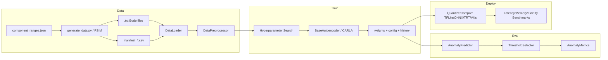

# Technical Documentation — Power-Converter Anomaly Detection

> A modular, converter-agnostic pipeline for **unsupervised / self-supervised anomaly
> detection** on the small-signal frequency response (Bode) of switched-mode power
> converters. It spans physics-grounded data generation, six autoencoder
> architectures plus a contrastive (CARLA) model, hyperparameter search, threshold
> calibration, and edge-deployment optimization/benchmarking.

---

## Table of Contents

1. [System Overview](#1-system-overview)
2. [Repository Layout](#2-repository-layout)
3. [Problem Formulation](#3-problem-formulation)
4. [Data Pipeline](#4-data-pipeline)
   - [4.1 Physical Model](#41-physical-model)
   - [4.2 Component Ranges](#42-component-ranges)
   - [4.3 Sampling Strategies](#43-sampling-strategies)
   - [4.4 Data Generation (PSIM)](#44-data-generation-psim)
   - [4.5 Manifest Format](#45-manifest-format)
   - [4.6 Labeling](#46-labeling)
   - [4.7 Loading, Backward-Compat, Migration, Multi-Dataset](#47-loading-backward-compat-migration-multi-dataset)
   - [4.8 Preprocessing](#48-preprocessing)
   - [4.9 Synthetic Fault Injection](#49-synthetic-fault-injection)
5. [Model Zoo](#5-model-zoo)
6. [Loss Functions](#6-loss-functions)
7. [Training](#7-training)
8. [Evaluation & Thresholding](#8-evaluation--thresholding)
9. [Inference](#9-inference)
10. [Edge Deployment](#10-edge-deployment)
11. [Configuration](#11-configuration)
12. [CLI Reference](#12-cli-reference)
13. [Experiment Artifacts](#13-experiment-artifacts)
14. [Testing](#14-testing)
15. [Adding a New Converter](#15-adding-a-new-converter)

---

## 1. System Overview



**Design principles**
- **Converter-agnostic core**: all converter-specific facts live in `data/<converter>/`
  (schematic, `parameters.txt`, `component_ranges.json`). `src/` contains only generic
  machinery.
- **One-class detection**: models train on healthy data only; anomalies are detected as
  deviations from the learned healthy manifold. CARLA additionally uses synthetic
  negatives for contrastive learning.
- **Separation of concerns**: `src/data` (I/O + labeling), `src/models` (architectures),
  `src/training` (loops + search), `src/evaluation`, `src/inference`, `src/deployment`.

---

## 2. Repository Layout

```
data/
  generate_data.py            # PSIM sweep -> Bode .txt + manifests (agnostic)
  buck/                       # a converter's data folder
    buck.psimsch, parameters.txt, component_ranges.json, buck_data/
src/
  data/                       # loading, labeling, preprocessing, generation helpers
    component_ranges.py       # ComponentRange spec + classification (dependency-free)
    manifest.py               # CSV manifest schema + reader/writer (dependency-free)
    loader.py                 # DataLoader, SimulationMetadata, parse_filename
    dataset.py                # PowerConverterDataset (splits, preprocess orchestration)
    preprocessor.py           # scalers + DataPreprocessor
    physics_anomaly.py        # analytic converter models + physics fault injector
    anomaly_injection.py      # heuristic (non-physics) injector
    migrate.py                # legacy pct-filename dataset -> manifest converter
    generator.py              # Keras Sequence batch generators
  models/                     # BaseAutoencoder + 6 AEs + contrastive_ae (CARLA)
  losses/contrastive.py       # NT-Xent, CARLA loss, center loss, embedding scoring
  training/                   # trainers, HP search, callbacks, optimizers
  evaluation/                 # metrics, threshold selection, plots
  inference/predictor.py      # AnomalyPredictor (load model + score)
  deployment/                 # quantization/compilation + benchmarking
  visualization/              # analysis + deck/plot styling
  utils/config.py             # configuration dataclasses
  train.py, evaluate.py       # training / evaluation CLIs
  deployment_optimization.py, deployment_evaluation.py  # deployment CLIs
scripts/                      # shell pipelines + synthetic data + deck generators
tests/                        # pytest suite
experiments/                  # trained model outputs
docs/                         # this file + references + parameters + research
```

~19 k LOC of Python across `src/` and `data/`.

---

## 3. Problem Formulation

The observable state of a converter is its **control-to-output transfer function**
`Gvd(s)` sampled as a Bode response: an array of shape `(seq_len, n_features)` with
`seq_len = 101` frequency points and `n_features = 2` (amplitude in dB, phase in
degrees) over the AC sweep (≈100 Hz – 50 kHz for the buck).

Let `Π_normal` be the Cartesian product of every component's healthy multiplier band.
The **healthy manifold** is `M_healthy = { Gvd(θ) : θ ∈ Π_normal }`. A sample is:

- **normal** — its response lies inside `M_healthy` (all components within tolerance);
- **anomalous** — at least one component crossed into its fault band, pushing the
  response outside `M_healthy` in a separable way;
- **unknown/gray** — degradation started but the response is in the ambiguous shell
  between healthy and clearly-faulty (excluded from both training and test).

Detection is **one-class**: models learn `M_healthy` and flag off-manifold samples.
Root-cause *diagnosis* is deliberately out of scope — in-band, capacitance/inductance
drops are degenerate and ESR/DCR/Rds rises are mutually confounded (the ESR zero is
out of the measured band), so a single Bode magnitude cannot uniquely attribute a fault.

---

## 4. Data Pipeline

### 4.1 Physical Model

`src/data/physics_anomaly.py` implements analytic converter models as a frozen-dataclass
hierarchy:

- `PowerConverter` (ABC) → `BuckConverter`, `BoostConverter`, `BuckBoostConverter`.
  Subclasses auto-register via `__init_subclass__` keyed by a `name` ClassVar.
- Canonical second-order `Gvd(s)`: `ω0 = m/√(LC)`, damping `Q` from parasitics, an ESR
  zero `ωz = 1/(Rc·C)`, and a right-half-plane zero for boost / buck-boost.
- `.scaled(component=factor)` returns a copy with component values multiplied; `.transfer_function()`
  builds the zpk response. Fault injection is a **multiplicative transfer ratio**
  `G(jω) = H_fault / H_nominal` applied to the complex response.

### 4.2 Component Ranges

`data/<converter>/component_ranges.json` — the single source of truth for what "healthy"
and "faulty" mean, plus how densely to sample. Parsed by `src/data/component_ranges.py`
into `ComponentRange` objects. **Dependency-free** (stdlib + JSON) so it runs on the PSIM
host and in the training environment.

```json
{
  "converter": "buck",
  "components": {
    "Cout":  {"normal": [0.80, 1.20], "normal_step": 0.05,
              "anomalous": [0.30, 0.70], "anomalous_step": 0.10, "note": "..."},
    "Esr_C": {"normal": [0.50, 2.00], "anomalous": [3.00, 8.00], "note": "..."},
    "Rout":  {"normal": [0.50, 2.00], "anomalous": null, "note": "operating point"}
  }
}
```

| Field | Meaning |
|---|---|
| `normal` | `(lo, hi)` healthy multiplier band (tolerance + temperature + ageing) |
| `anomalous` | `(lo, hi)` degradation band, or `null` for an operating-point knob (never a fault) |
| `normal_step` | optional additive step for the healthy **grid** sweep (fine) |
| `anomalous_step` | optional additive step for the fault severity sweep (coarse) |

**Classification API** (`component_ranges.py`):
- `pct_to_mult` / `mult_to_pct` — convert between percentage deviation and multiplier.
- `ComponentRange.classify_multiplier(m)` → `normal` / `anomalous` / `unknown`, with
  direction-aware fault detection (down-faults like C↓, up-faults like ESR↑).
- `classify_variations(variations, ranges, fallback_threshold=5.0)` → whole-sample label:
  `anomalous` if any component is faulted, `normal` if all healthy, else `unknown`.
- `load_ranges(path)`, `find_ranges_file(dir)`, `load_ranges_for(dir)` — discovery/loading.

Buck bands are grounded in `docs/REFERENCES.md` — e.g. Cout fault onset `0.70` and Esr_C
onset `3.0×` follow the IEC 60384-4-1 endurance criteria (−30% capacitance / ×3 ESR).

### 4.3 Sampling Strategies

Implemented in `data/generate_data.py`. Two independent axes: the **healthy** set and the
**faulty** set, each with its own mode.

**Latin-Hypercube Sampling (LHS)** — `_lhs(n, d, rng)` (numpy-only, dependency-free):
stratifies each dimension into `n` equal-probability bins with one sample per bin, shuffled
independently per dimension — gap-free coverage of the tolerance box with far fewer samples
than a full grid.

| Set | Modes | Behavior |
|---|---|---|
| Healthy | `lhs` (default), `random`, `grid` | `lhs`: stratified over the joint tolerance box; `grid`: Cartesian product honouring per-component `normal_step` |
| Faulty | `lhs` (default), `grid` | `lhs`: `--n-fault` split across components; `grid`: deterministic severity steps (`anomalous_step` / `--fault-levels`) |

**Multi-component faults** (`build_fault_combinations_lhs`): each faulty sample has a
guaranteed **primary** fault (component evenly assigned across the budget) plus each other
fault-capable component independently faulting with probability `--fault-prob` (default
`0.1`). Fault multiplicity is `1 + Binomial(C−1, p)`; non-faulted components are drawn from
their **normal** bands (realistic tolerance spread). Faulted → anomalous band; all values
LHS-stratified; every sample keeps at least one fault (always labelled `anomalous`).

**Step semantics** (`_levels_for(lo, hi, step, count)`): if a step is given it wins
(linear/additive spacing, upper edge always included), else `count` evenly-spaced levels.
Precedence: per-component JSON step → global `--normal-step`/`--fault-step` → level count.

### 4.4 Data Generation (PSIM)

`data/generate_data.py` sweeps component values in PSIM (`psimapipy`, imported lazily so
`--estimate` runs without it) and exports one Bode `.txt` per combination.

Pipeline: `plan_generation()` (pure, unit-tested) assigns each combination an **opaque
filename** and a manifest row, applying **resume**; a multiprocessing `Pool` runs the sims
via `imap_unordered`; the parent process appends each manifest row **in real time** as the
worker reports success (race-free — only the parent writes).

Key flags: `--converter`, `--components`, `--normal-mode/--fault-mode`, `--n-normal/--n-fault`,
`--normal-step/--fault-step`, `--normal-levels/--fault-levels`, `--fault-prob`,
`--fault-backgrounds` (grid), `--correlated` (C↓&ESR↑ ageing trajectory), `--estimate`,
`--seed`. `--estimate` prints the per-component sampling plan and total count without
touching PSIM.

### 4.5 Manifest Format

`src/data/manifest.py` (dependency-free, stdlib `csv`). One manifest per generation mode,
written next to the `.txt` files:

- `manifest_grid.csv` — deterministic step-grid samples
- `manifest_lhs.csv` — Latin-hypercube (and plain random) samples

Schema (one row per simulation):

```
filename, set, label, n_faults, mode, key, <Comp1>, <Comp2>, ...
```

| Column | Meaning |
|---|---|
| `filename` | opaque id, e.g. `lhs_000042.txt` |
| `set` | `healthy` / `fault` (generation intent) |
| `label` | `normal` / `anomalous` / `unknown` (classification) |
| `n_faults` | number of components in their anomalous band |
| `mode` | `grid` / `lhs` / `random` |
| `key` | deterministic combo signature (grid dedup; empty for lhs) |
| `<Comp*>` | component **multiplier** on nominal (`1.0` = nominal) |

Core API: `ManifestWriter` (append + flush per row), `read_manifest`, `load_manifest_index`
(filename → {label, set, multipliers}), `make_key`, `existing_keys`, `count_set`,
`next_index`, `make_filename`.

**Resume logic**: grid runs skip combinations whose `key` already exists; LHS runs top up to
the requested count. Real-time flushing means an interrupted run keeps all completed rows and
resumes cleanly.

### 4.6 Labeling

Labels are computed at generation time (`classify_variations`) and stored in the manifest.
At load time, `DataLoader._label(meta)` returns the manifest label when present; otherwise it
classifies from the per-component ranges (`use_component_ranges=True`, default) or falls back
to a flat `|deviation| ≤ normal_threshold` rule. `unknown`/gray samples are excluded from both
the normal and anomaly index sets.

### 4.7 Loading, Backward-Compat, Migration, Multi-Dataset

`src/data/loader.py`:

- **`SimulationMetadata`** `(filename, variations, label)` — `variations` are percentage
  deviations; `label` is populated from the manifest when available.
- **`load_all_simulations(data_dir)`** is **manifest-first**: it reads `manifest_*.csv` for
  metadata, else falls back to `parse_filename` for legacy percentage-encoded names
  (`Cout_-20__Rds_1_-5.txt`). Opaque ids that lack a manifest yield empty variations
  (`_OPAQUE_ID_RE`), never junk.
- **`DataLoader(data_dir, ...)`** accepts a **single directory or a list**; multiple
  directories are concatenated (e.g. combine `lhs` + `grid` runs). Frequency grid and ranges
  come from the first directory; caching keys on a hash of all dirs + `max_files`. Exposes
  `get_normal_indices()`, `get_anomaly_indices()`, `split_normal_anomaly()`,
  `get_train_val_test_split()`.

**Migration** (`src/data/migrate.py`, CLI `python -m src.data.migrate`): converts a legacy
pct-filename dataset into the manifest format. Non-destructive by default (writes a manifest
referencing existing filenames); `--rename` also renames files to opaque ids. Idempotent
(already-listed files are skipped).

**`PowerConverterDataset`** (`src/data/dataset.py`) wraps `DataLoader` + `DataPreprocessor`,
also accepts one or more directories, and produces train/val/test splits. Training/validation
use only normal data; test mixes normal + anomalous. It also builds a `fit_val` split (normal
+ a slice of anomalies) used for threshold calibration.

### 4.8 Preprocessing

`src/data/preprocessor.py`:

- Scalers (`BaseScaler` → `StandardScaler`, `MinMaxScaler`, `RobustScaler`), each supporting
  `fit/transform/inverse_transform/save/load`, per-feature over the last axis of a
  `(n_samples, seq_len, n_features)` tensor.
- **`DataPreprocessor(scaler_type="standard", log_transform_amplitude=True, per_feature=True)`**
  — optionally applies a dB/log transform to the amplitude channel, then scaling. Fit **only
  on normal training data** to avoid leaking anomaly statistics; persisted under
  `experiments/<model>/preprocessor/`.

### 4.9 Synthetic Fault Injection

Used by CARLA to create negatives on the fly (no PSIM required):

- **`PhysicsAnomalyInjector`** (`physics_anomaly.py`) applies a component-level perturbation
  through the analytic model as a multiplicative transfer ratio. `DEFAULT_FAULT_MODES`
  severities mirror the `anomalous` bands (e.g. `capacitor_esr=(3.0, 8.0)`,
  `capacitance_drop=(0.30, 0.70)`, `inductor_saturation=(0.40, 0.70)`,
  `switch_degradation=(3.0, 15.0)`, `load_change=(0.3, 3.0)` log-uniform), so injected
  negatives sit **outside** the healthy envelope. `inject(sample)` / `inject_batch(batch)`.
- **`AnomalyInjector`** (`anomaly_injection.py`) — simpler heuristic perturbations (noise,
  spikes, scaling) as a non-physics baseline.

---

## 5. Model Zoo

All architectures inherit **`BaseAutoencoder`** (`src/models/base.py`):
`build()`, `compile(optimizer, learning_rate, loss)`, `fit(...)`, `reconstruction_error(X)`
(per-sample MSE for scoring); abstract `_build_encoder()` / `_build_decoder()`. Input shape
`(101, 2)`; anomaly score = reconstruction error (VAE/CARLA add terms).

| Model | File | Distinctive params | Notes |
|---|---|---|---|
| **Conv1D-AE** | `conv1d_ae.py` | `filters=[32,64,128]`, `kernel_size`, `pool_size` | Temporal convolutions; strong default |
| **LSTM-AE** | `lstm_ae.py` | `lstm_units=[64,32]`, `bidirectional`, `recurrent_dropout` | Recurrent |
| **GRU-AE** | `gru_ae.py` | `gru_units=[64,32]` | Lighter recurrent |
| **MLP-AE** | `mlp_ae.py` | encoder/decoder dense units | Flattened baseline |
| **VAE** | `vae.py` | `kl_weight`, `use_conv` | Reparameterized latent; score = recon + latent log-prob |
| **Transformer-AE** | `transformer_ae.py` | `num_heads`, `ff_dim`, `num_transformer_blocks` | Self-attention + positional encoding |
| **CARLA** | `contrastive_ae.py` | `ProjectionHead(hidden_dim=128, output_dim=64, num_layers)` | AE + projection head; contrastive; score via latent k-NN |

Shared hyperparameters: `latent_dim ∈ {16,32,64,128}`, `dropout_rate`, `use_batch_norm`,
`activation ∈ {relu, gelu, swish, mish, elu, leaky_relu, selu}`.

---

## 6. Loss Functions

`src/losses/contrastive.py`:

- **`reconstruction_loss(y_true, y_pred, loss_type)`** — `mse` / `mae` / `huber`.
- **`NTXentLoss(temperature=0.1)`** — SimCLR-style normalized temperature-scaled cross-entropy;
  uses in-batch or explicit negatives.
- **`ContrastiveLoss(margin=1.0)`** — margin-based pair loss.
- **`CARLALoss(reconstruction_weight, contrastive_weight, temperature, margin)`** — combined
  `w_r · recon + w_c · NT-Xent` on projected embeddings.
- **`CenterLoss`** — minimizes intra-class latent variance (cluster compactness).
- **`anomaly_score_from_embeddings(..., method)`** — `knn` (default, mean distance to k
  nearest), `centroid`, `cosine`, or `mahalanobis`.

---

## 7. Training

`src/training/`:

- **`BaseTrainer` / `BaseTrainingConfig`** — GPU setup, checkpoint/log dirs, early stopping
  (`patience`, `min_delta`), LR reduction (`reduce_lr`, `lr_patience`, `lr_factor`), mixed
  precision.
- **`Trainer` / `TrainingConfig`** (standard AEs) — `MODEL_REGISTRY` maps model names to
  classes; `create_model → compile_model → train` using Keras `fit` with the callback stack.
- **`CARLATrainer` / `CARLAConfig`** — **custom training loop** (not `fit`): injects synthetic
  anomalies as negatives (`PhysicsAnomalyInjector`/`AnomalyInjector`), optimizes `CARLALoss`
  (+ optional `CenterLoss`), and scores via latent embeddings. Config includes
  `reconstruction_weight`, `contrastive_weight`, `temperature`, `anomaly_ratio`,
  `n_negative_per_sample`, `use_physics_anomalies`, `scoring_method ∈ {knn, centroid,
  mahalanobis}`, `k_neighbors`.
- **Hyperparameter search** — `hyperparameter_search.py` (`SearchSpace`) and
  `carla_hyperparameter_search.py` (`CARLASearchSpace`), backed by Keras Tuner with
  **Bayesian / Random / Grid / Hyperband** strategies. CARLA space adds encoder type,
  loss weights, temperatures, anomaly ratios, k-neighbors.
- **`callbacks.py`** — `EarlyStoppingWithRestore` + ModelCheckpoint / ReduceLROnPlateau /
  TensorBoard via `get_callbacks()`.
- **`optimizers.py`** — `create_optimizer` (adam, adamw, nadam, sgd, rmsprop, lion, adagrad)
  and `create_lr_schedule` (constant, cosine, warmup_cosine, exponential, step, polynomial).

Flow: search over `--n-trials` → retrain best config for `--final-epochs` → persist artifacts.

---

## 8. Evaluation & Thresholding

`src/evaluation/`:

- **`metrics.py`** — `AnomalyMetrics` (precision, recall, f1, accuracy; auc_roc, auc_pr,
  average_precision; confusion counts; reconstruction-error separability). Helpers:
  `compute_reconstruction_metrics`, `compute_classification_metrics`, `evaluate_model`.
- **`threshold.py`** — `ThresholdSelector(method, **kwargs).fit(normal_errors, anomaly_errors,
  labels)`:
  - `percentile` — `np.percentile(normal_errors, p)` (default 95);
  - `std` — `mean + n_std·std` (default 3);
  - `f1` — grid search maximizing F1 on a labelled validation slice;
  - `youden` — maximize sensitivity + specificity;
  - `fixed` — user value.
  Calibrated on the dataset's `fit_val` split (normal + held-out anomalies).
- **`visualization.py`** — error-distribution, ROC, PR, confusion-matrix, and threshold-analysis
  plots; `create_evaluation_report(...)` assembles a multi-panel report.

---

## 9. Inference

`src/inference/predictor.py` — **`AnomalyPredictor(model_dir, threshold=None)`** loads
`model_config.json`, `threshold.json`, `preprocessor/`, and `best_model.weights.h5`, and
auto-detects standard vs. CARLA. Methods:

- `predict_file(filepath)` — load a single Bode `.txt` (tolerant of opaque ids and legacy
  names) → `{anomaly_score, is_anomaly, threshold, reconstruction_error, metadata}`;
- `predict_batch(X, return_embeddings=False)` — array `(batch, 101, 2)` → scores + predictions;
- `reconstruction_error(X)`, `decision_function(X)`.

---

## 10. Edge Deployment

`src/deployment/` + two CLIs.

**Optimization** (`deployment_optimization.py`) loads a trained model + a calibration subset,
then produces:

| Backend | Variants | Target |
|---|---|---|
| Keras / TFLite | dynamic, float16, int8 (+ native int8) | CPU / mobile / MCU |
| ONNX Runtime | fp32, int8 (QDQ) | CPU |
| TensorRT | fp32, fp16, int8 | NVIDIA GPU |
| Xilinx Vitis AI | int8 quantized + compiled | FPGA (`zcu102/104`, `kv260`, `ultra96`, `pynq_z2`) |

Modules: `keras_quantization.py`, `onnx_trt.py`, `vitis_ai.py`, `utils.py` (calibration /
sizes), `runners.py` (uniform `Callable[[np.ndarray], np.ndarray]` runners per backend).

**Evaluation** (`deployment_evaluation.py`) scans converted artifacts and runs:
- `timing_memory_benchmark.py` — latency (mean/std/min/max) + net & peak RAM/VRAM, under a
  uniform protocol (batch n=1, 15 warm-up, 150 timed runs);
- `timing_evaluation.py` — classification fidelity (accuracy, precision, recall, F1, AUC) per
  format.

Outputs a consolidated `unified_deployment_report.md` under `<model-dir>/deployment/`.

---

## 11. Configuration

`src/utils/config.py` — dataclasses:

- **`DataConfig`** — `data_dir`, `cache_dir`, `sequence_length=101`, `num_features=2`,
  `normalize`, `normalization_method`, `log_transform_amplitude`, train/val/test ratios,
  `normal_threshold_percent`, augmentation flags.
- **`ModelConfig`** — architecture params (`encoder_filters`, `encoder_kernel_sizes`,
  `latent_dim`, recurrent units, attention params, `kl_weight`, `dropout_rate`,
  `l2_regularization`, `use_batch_norm`, activations).

`src/utils/logger.py` provides the shared logger used across modules.

---

## 12. CLI Reference

**Generate data**
```bash
PYTHONPATH=. python data/generate_data.py --estimate                 # dry-run plan
PYTHONPATH=. python data/generate_data.py --converter buck \
    --normal-mode lhs --n-normal 1000 --fault-mode lhs --n-fault 300 --fault-prob 0.1
```

**Synthetic (no PSIM)**
```bash
PYTHONPATH=. python scripts/generate_synthetic_buck.py --out data/buck/buck_data_debug \
    --n-normal 30 --n-anomaly 20
```

**Migrate a legacy dataset**
```bash
python -m src.data.migrate --data-dir data/buck/buck_data [--mode grid|lhs] [--rename]
```

**Train** (single or multiple `--data-dir`)
```bash
python -m src.train --model conv1d_ae --n-trials 15 --final-epochs 100 --data-dir data/buck/buck_data
python -m src.train --model carla --data-dir data/buck/run_lhs data/buck/run_grid
python -m src.train --model conv1d_ae --debug
```

**Evaluate**
```bash
python -m src.evaluate --model-dir experiments/conv1d_ae --threshold-method percentile
python -m src.evaluate --model-dir experiments/conv1d_ae --predict-files data/buck/buck_data/lhs_000042.txt
```

**Deploy**
```bash
python -m src.deployment_optimization --model-dir experiments/conv1d_ae --run-all --vitis-target pynq_z2
python -m src.deployment_evaluation  --model-dir experiments/conv1d_ae
```

---

## 13. Experiment Artifacts

```
experiments/<model>/
├── best_model.weights.h5     # trained weights
├── model_config.json         # best hyperparameters / architecture
├── training_history.json     # loss/val_loss (and CARLA loss terms) per epoch
├── threshold.json            # {threshold, method, fit_statistics}
├── metrics.json              # AnomalyMetrics (precision/recall/f1/auc_roc/...)
├── test_results.csv          # per-sample score, prediction, true label
├── preprocessor/             # persisted DataPreprocessor (scaler params)
├── deployment/               # quantized/compiled artifacts + reports
├── checkpoints/, logs/       # optional
└── search_results.json       # HP-search trials (CARLA)
```

---

## 14. Testing

`pytest` suite under `tests/` (data, models, losses, training, evaluation, deployment):

```bash
uv run pytest                      # all tests
uv run pytest tests/data -q        # data pipeline only
uv run pytest --cov=src tests/     # with coverage
```

Notable data tests: `test_component_ranges.py` (classification bands), `test_manifest.py`
(manifest round-trip + resume planning), `test_dataset_io.py` (backward-compat, migration,
multi-directory loading), `test_physics_anomaly.py` (injector + converter models).

---

## 15. Adding a New Converter

No `src/` changes required:

1. Create `data/<converter>/` with `<converter>.psimsch` and `parameters.txt` (nominal values).
2. Add `component_ranges.json` — declare each component's `normal` / `anomalous` bands
   (and optional `normal_step` / `anomalous_step`); set `anomalous: null` for operating-point
   knobs. Ground the numbers in datasheets / standards (see `docs/REFERENCES.md`).
3. If the converter needs a new analytic model for synthetic injection, subclass
   `PowerConverter` in `src/data/physics_anomaly.py` (auto-registers by `name`).
4. Generate: `python data/generate_data.py --converter <converter> --estimate` then run for real.
5. Train/evaluate exactly as for the buck: `python -m src.train --model carla --data-dir data/<converter>/<converter>_data`.

The loader auto-discovers `component_ranges.json`, labels from the manifest, and everything
downstream is converter-agnostic.
