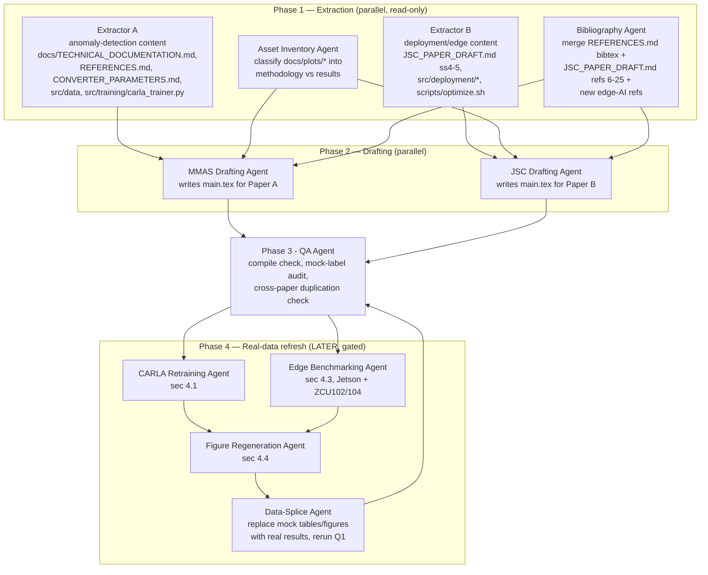

# Research &amp; Drafting Plan — Two Journal Papers from `fault_converters`

Status: **planning artifact + initial LaTeX drafts generated**. Numeric results in both
drafts are **mock placeholders** (clearly labelled) because the underlying experiments
are not finished yet:

- **CARLA** needs a full retrain — the physics-informed anomaly injector
  (`src/data/physics_anomaly.py`, `PhysicsAnomalyInjector`, wired into
  `src/training/carla_trainer.py` via `CARLAConfig.use_physics_anomalies` — default
  `True`) post-dates the last completed CARLA run in `experiments/carla/` (which has
  `search_results.json` + `metrics.json` but no `best_model.h5`, i.e. HP search ran but
  the final physics-informed model was never retrained/frozen).
- **Deployment benchmarks** exist only for `conv1d_ae` on an **RTX 4070 workstation**
  (`experiments/conv1d_ae/deployment/unified_deployment_report.json`). The two edge
  targets this plan is written for — **NVIDIA Jetson Nano** and **Xilinx Zynq
  UltraScale+ (ZCU102/ZCU104)** — have never been benchmarked; Vitis AI code paths
  exist (`src/deployment/vitis_ai.py`) but produce no report yet.

This document is the plan an autonomous agent (or a small multi-agent crew) should
follow to (a) keep mining the repo for paper content, (b) regenerate the real results,
and (c) splice them into the two drafts this session already produced.

---

## 1. Scope split

Both papers come out of the same codebase/dataset but must not be near-duplicates.
Shared background (buck converter, Bode signature dataset) gets **one short paragraph
each**, with the fuller treatment living in only one of the two papers.

| | **Paper A — MMAS** | **Paper B — JSC** |
|---|---|---|
| Target venue | *Mathematical Methods in the Applied Sciences* (Wiley) | *Journal of Supercomputing* (Springer) |
| Draft file | [papers/mmas_anomaly_detection/main.tex](mmas_anomaly_detection/main.tex) | [papers/jsc_edge_deployment/main.tex](jsc_edge_deployment/main.tex) |
| Focus | Anomaly-detection module: physics-informed CARLA contrastive learning vs. the 6 autoencoder baselines | Brief problem recap, then model **optimization + edge-AI deployment**: Jetson Nano (GPU-embedded) vs. Xilinx Zynq UltraScale+ (FPGA-embedded/DPU) |
| Depth on dataset/physics | Full (transfer-function derivation, component ranges, fault taxonomy) | One paragraph + cross-reference to Paper A |
| Depth on CARLA method | Full (architecture, loss, physics-informed negative synthesis, ablation) | One paragraph ("the anomaly detector under test") |
| Depth on quantization/HW benchmarking | Not covered | Full (formats, protocol, cross-hardware tables) |
| Primary novel contribution vs. existing CMMSE 2026 talk/`docs/JSC_PAPER_DRAFT.md` | Physics-informed negative sampling ablation (heuristic vs. physics-based CARLA) | First edge-hardware (non-workstation-GPU) benchmark of the pipeline; GPU-embedded vs. FPGA-embedded comparison |

Cross-reference each other with a footnote (no `\cite`, since neither has a DOI yet):
*"A companion manuscript submitted to the Journal of Supercomputing addresses the
edge-deployment optimization of this framework in depth."* (and the symmetric sentence
in Paper B).

---

## 2. Source-of-truth inventory (what already exists, mapped to each paper)

### Directly reusable prose/content
| Source | Reusable for | Notes |
|---|---|---|
| [docs/JSC_PAPER_DRAFT.md](../docs/JSC_PAPER_DRAFT.md) §1–3.3 | Paper A intro/related work/CARLA method | This is the CMMSE 2026 talk's combined draft; §1–3 already reads like a self-contained anomaly-detection paper. **Caveat:** its dataset description (§2) uses the *old* flat ±5%/±20% labeling scheme — superseded by the range-based `component_ranges.json` + LHS scheme (see `/memories/repo/dataset-and-debug.md`). Paper A's dataset section must describe the **current** scheme, not copy §2 verbatim. |
| [docs/JSC_PAPER_DRAFT.md](../docs/JSC_PAPER_DRAFT.md) §4–5.1 | Paper B optimization/hardware profiling | RTX 4070 + Ryzen 5800X numbers here are **real, already measured** — reusable as an "interim reference platform" result, not mock. |
| [docs/TECHNICAL_DOCUMENTATION.md](../docs/TECHNICAL_DOCUMENTATION.md) | Both — architecture list, training pipeline, deployment pipeline | Dense technical reference; §4–5 (data pipeline), §7 (training), §10 (deployment) most relevant. |
| [docs/REFERENCES.md](../docs/REFERENCES.md) | Both | BibTeX block copied into [papers/shared/references.bib](shared/references.bib). |
| [docs/CONVERTER_PARAMETERS.md](../docs/CONVERTER_PARAMETERS.md) | Paper A problem formulation | Component health-indicator tables, ripple equations. |
| [docs/CALL_FOR_PAPERS.tex](../docs/CALL_FOR_PAPERS.tex) | Both (LaTeX starting point) | `article` class, `IEEEtran` bibstyle, `hyperref`/`booktabs`/`amsmath` — reused as the preamble skeleton for both drafts pending the real Wiley/Springer class files (see §8). |
| `src/data/physics_anomaly.py` (`DEFAULT_FAULT_MODES`) | Paper A CARLA method | Real, current fault-mode ranges: `capacitor_esr` (3–8×), `capacitance_drop` (0.3–0.7×), `inductor_saturation` (0.4–0.7×), `switch_degradation` (3–15×), `load_change` (0.3–3×, log-uniform). |
| `experiments/carla/model_config.json` | Paper A CARLA method (hyperparameters) | Real current config (latent_dim=128, projection_dim=64, lr=1e-4, reconstruction_wt=0.1, contrastive_wt=0.5, k=5) — safe to cite as *configuration*, NOT as final *results*. |
| `src/deployment/utils.py` (`TIMING_BATCH_SIZE/WARMUP/RUNS`) | Paper B benchmarking protocol | Real, current uniform timing protocol (n=1, 15 warmup, 150 runs). |
| `src/deployment/vitis_ai.py` (`VITIS_TARGETS` dict — name may differ) | Paper B hardware section | Real board list: `zcu102`/`zcu104` = Zynq UltraScale+ MPSoC (DPU `DPUCZDX8G_ISA1_B4096`), `kv260` = Kria KV260, `ultra96`, `pynq_z2` (`B1024` DPU, Zynq-7000 not UltraScale+). **"Xilinx UltraScale" in the user's request = `zcu102`/`zcu104`.** |
| `docs/plots/*` | Both | See §3 (figure inventory) — split into "methodology" (reusable now) vs. "results" (must stay placeholders). |

### Existing numeric results and their validity for each paper
| Result | Location | Status |
|---|---|---|
| 6-architecture comparison table (Conv1D 0.963 F1 … GRU 0.550 F1) | `docs/JSC_PAPER_DRAFT.md` Table 4, `experiments/<model>/metrics.json` | Real, but trained under **the labeling/data-generation scheme active at the time** — should be re-verified against the current range-based sampler before being called final. Treated as **mock/pending re-verification** in both drafts for consistency (see §5). |
| CARLA baseline (F1 0.825, ROC-AUC 0.831) | `experiments/carla/metrics.json` | Real but **pre-physics-informed-injector** — explicitly the stale baseline the retrain must beat. Not used in the results tables; only mentioned in the "prior baseline" framing / ablation motivation. |
| RTX 4070 deployment suite (9 backends: TFLite/ONNX/TensorRT × precisions) | `experiments/conv1d_ae/deployment/unified_deployment_report.json`, `docs/JSC_PAPER_DRAFT.md` Tables 1–3 | Real, reusable **as-is** in Paper B as the interim workstation-GPU reference column. |
| Jetson Nano / Xilinx ZCU102 latency, memory, power, accuracy | N/A — never measured | **100% mock** in Paper B. |

---

## 3. Figure/asset inventory (`docs/plots/`, 60+ files)

Rule used in both drafts: **methodology/architecture/domain figures that don't depend
on the pending retrain are reused for real; anything under a Results section is a
placeholder** (`\figureplaceholder{...}`) until the real run finishes.

| Category | Examples | Treatment |
|---|---|---|
| Architecture diagrams | `arch_hero_conv1d_ae.png`, `arch_diagram_carla.png`, `arch_hero_vae.png` | **Reused for real** — model structure is unaffected by retraining. |
| Domain / dataset illustration | `buck_converter_schematic.png`, `anomaly_deviation_Cout.png`, `anomaly_deviation_Esr_C.png` | **Reused for real** as illustrative examples in the dataset/problem sections. |
| RTX deployment results (conv1d_ae only) | `deploy_latency_conv1d_ae.png`, `deploy_hardware_conv1d_ae.png`, `deploy_tradeoff_conv1d_ae.png`, `deploy_model_size_conv1d_ae.png`, `deploy_mse_shift_conv1d_ae.png`, `deploy_batch_scaling_conv1d_ae.png` | **Reused for real** in Paper B, labelled "interim reference platform." |
| Model-accuracy results (any architecture, incl. CARLA) | `confusion_matrix_carla.png`, `final_metrics_comparison.png`, `score_vs_deviation_conv1d_ae.png`, `hp_search_*.png` | **Placeholder** — these are exactly what the retrain will regenerate; using the stale versions would misrepresent the new CARLA. |
| Edge-hardware results (Jetson/Xilinx) | none exist | **Placeholder** (nothing to reuse). |

Regeneration entry points once real data exists: `scripts/generate_deck_svgs.py`,
`scripts/generate_arch_diagrams.py`, `notebooks/explore_results.ipynb`,
`notebooks/explore_deployment.ipynb` (see `/memories/repo/plot-styling.md`).

---

## 4. Gap analysis — exact commands to obtain the missing information

Run from the repo root with the project's `uv` environment.

### 4.1 Retrain CARLA with the current (physics-informed) implementation
```bash
PYTHONPATH=. uv run python -m src.train \
  --model carla \
  --n-trials 30 \
  --final-epochs 100 \
  --data-dir data/buck/buck_data \
  --search-method bayesian \
  --objective roc_auc
```
- `use_physics_anomalies=True` is the current `CARLAConfig` default — no extra flag
  needed; simply retraining with today's code exercises the new injector.
- Add `--encoder-types conv1d transformer mlp` / `--latent-dims ...` to narrow the
  search space if a faster turnaround is needed.
- Recommended **ablation** for the MMAS paper: retrain a second CARLA run with
  physics-informed injection disabled (heuristic-only) to produce a controlled
  "before/after" comparison. This currently requires a small code change (expose
  `use_physics_anomalies` as a CLI flag, or a one-off script instantiating
  `CARLATrainer(config=CARLAConfig(use_physics_anomalies=False))`), since it is not
  presently CLI-exposed.
- Output lands in `experiments/carla/` (or pass `--experiment-name` to keep both the
  heuristic and physics-informed runs side by side, e.g. `carla_heuristic` /
  `carla_physics`).

### 4.2 Re-verify / retrain the 6 baseline autoencoders (optional but recommended)
```bash
bash scripts/train_all.sh   # loops the 6 architectures; check the script for exact per-model flags
```
Only strictly required if the dataset was regenerated under the newer range-based
sampler since the existing `experiments/<model>/metrics.json` were produced — otherwise
the current baseline numbers may already be valid for reuse (a human call, not
automated by this plan).

### 4.3 Deployment optimization + evaluation on a given hardware target
```bash
# 1. Compile/quantize
python -m src.deployment_optimization \
  --model-dir experiments/<model> \
  --data-dir data/buck/buck_data \
  --vitis-target zcu102        # or zcu104 for the UltraScale+ comparison

# 2. Benchmark
python -m src.deployment_evaluation \
  --model-dir experiments/<model> \
  --data-dir data/buck/buck_data
```
- On the **RTX workstation** this already exists for `conv1d_ae`
  (`scripts/optimize.sh` / `scripts/evaluate_inference.sh` — currently hardcoded to
  `--vitis-target pynq_z2`; change to `zcu102` for the UltraScale+ target).
- On **Jetson Nano**: run the same two commands *on-device* (JetPack ships its own
  TensorRT build; the ONNX→TensorRT engine must be re-serialized locally, it does not
  cross-compile from the RTX host). No code changes expected — the pipeline is
  generic TensorRT/ONNX/TFLite, nothing Jetson-specific needs to be written.
- On **Xilinx ZCU102/ZCU104**: requires the Vitis AI INT8 quantize+compile step
  (`src/deployment/vitis_ai.py`) run on a host with the Vitis AI Docker toolchain, then
  the compiled `.xmodel` copied to the board and executed via the `pynq-dpu` runtime
  (see the `deploy_pynq.py` script mentioned in `experiments/conv1d_ae/deployment/`).
  This path is implemented but **never benchmarked** — treat as the highest-value gap
  to close for Paper B.
- Add a **power/energy** measurement (Watts via on-board INA sensor or USB power
  meter; Jetson also exposes `tegrastats`) — not currently instrumented anywhere in
  `src/deployment/`; new code required if this metric is wanted in the final paper
  (currently drafted as a placeholder table in Paper B).

### 4.4 Regenerate figures once new data exists
```bash
uv run python scripts/generate_deck_svgs.py       # SVG deck charts from experiments/*/metrics.json
uv run python scripts/generate_arch_diagrams.py   # architecture diagrams (only needed if new archs added)
# notebooks/explore_results.ipynb and explore_deployment.ipynb for the rest
```

---

## 5. Mock-data / placeholder conventions used in both drafts

To avoid any ambiguity between real and placeholder content:

1. Every **table** containing pending numbers has its caption suffixed with
   *"(Mock data — placeholder pending real experiments; see the Reproducibility
   section.)"* in red-tinted text via `\mocknote`.
2. Every **figure** not yet generated uses the `\figureplaceholder{label}{caption}`
   macro (dashed/boxed "FIGURE PLACEHOLDER" — no external image dependency, so both
   `.tex` files compile standalone without any generated artwork).
3. A **draft-status banner** right after `\maketitle` in both files states plainly
   that the manuscript is an initial draft with placeholder results.
4. Real, already-measured numbers that are being reused "as-is" (RTX 4070 deployment
   suite in Paper B; architecture/dataset figures in both) are **not** marked mock —
   they are real, just not yet the final target-hardware/target-model numbers, and the
   surrounding prose says so explicitly (e.g., "interim reference platform").

---

## 6. Multi-agent execution plan

Phases 1–3 is what an agent should run **now** (mirrors what was actually executed
this session, so re-running is idempotent/safe). Phase 4 is future work, gated on
retraining/hardware access, and should be re-invoked once those become available.



### Agent responsibilities

| Agent | Inputs | Output | Notes |
|---|---|---|---|
| **Extractor A** (anomaly detection) | docs/, `src/data/`, `src/training/carla_trainer.py`, `src/models/` | Structured dossier (facts, equations, config values) scoped to Paper A | Already executed this session via the `Explore` subagent transcripts folded into §2 above. |
| **Extractor B** (deployment) | `docs/JSC_PAPER_DRAFT.md` §4–5, `src/deployment/`, repo memory `deployment-pipeline.md` | Dossier scoped to Paper B | Same. |
| **Asset Inventory Agent** | `docs/plots/` directory listing | Methodology-vs-results classification (§3) | Done — reuse the table above; re-run only if `docs/plots/` changes. |
| **Bibliography Agent** | `docs/REFERENCES.md`, `docs/JSC_PAPER_DRAFT.md` §7 | [papers/shared/references.bib](shared/references.bib) | Done, but the 7 entries marked `VERIFY` (Jetson/Xilinx/quantization surveys) need a real web check before submission — this session's web fetches were blocked by cookie/redirect walls and could not confirm them. |
| **MMAS Drafting Agent** | Extractor A + Asset Inventory + bib | [papers/mmas_anomaly_detection/main.tex](mmas_anomaly_detection/main.tex) | Done this session. |
| **JSC Drafting Agent** | Extractor B + Asset Inventory + bib | [papers/jsc_edge_deployment/main.tex](jsc_edge_deployment/main.tex) | Done this session. |
| **QA Agent** | Both `.tex` files | Compile check (pdflatex+bibtex) + mock-label audit + duplication check | **Not run this session — no LaTeX toolchain installed locally** (`pdflatex`/`tectonic`/`latexmk` all absent). Run before trusting either file compiles; see §8. |
| **CARLA Retraining Agent** | §4.1 commands | New `experiments/carla*/` results | Future — gated on compute time/GPU access. |
| **Edge Benchmarking Agent** | §4.3 commands, physical Jetson Nano + ZCU102/104 boards | Per-device `unified_deployment_report.json` | Future — gated on hardware access. |
| **Figure Regeneration Agent** | §4.4 commands | Refreshed `docs/plots/*` | Future — after R1/R2. |
| **Data-Splice Agent** | Real results from R1–R3 | Updated `.tex` files, mock labels/placeholders removed | Future — final step before submission. |

---

## 7. Task checklist

**Done (this session):**
- [x] Inventory docs/, experiments/, src/ for reusable content and result status.
- [x] Split scope between the two papers, avoiding duplication.
- [x] Build shared BibTeX file from existing repo references + new edge-AI refs (flagged for verification).
- [x] Draft `papers/mmas_anomaly_detection/main.tex` (mock results, real methodology).
- [x] Draft `papers/jsc_edge_deployment/main.tex` (mock edge-HW results, real RTX interim results, real protocol description).

**Next (before submission — see §6 Phase 4):**
- [ ] Retrain CARLA (physics-informed) and, ideally, a heuristic-injection ablation run (§4.1).
- [ ] Re-verify or retrain the 6 baseline autoencoders if the dataset/labeling scheme changed since their last run.
- [ ] Run deployment optimization + evaluation on Jetson Nano (§4.3).
- [ ] Run Vitis AI quantize/compile/deploy on ZCU102 or ZCU104 (§4.3) — highest-effort gap, needs the Vitis AI Docker toolchain + physical board.
- [ ] (Optional, strengthens Paper B) Instrument power/energy measurement — not implemented anywhere yet.
- [ ] Regenerate figures (§4.4) and splice real numbers/figures into both drafts, removing all `\figureplaceholder`/mock captions.
- [ ] Install a LaTeX toolchain (or use Overleaf) and compile both drafts; fix any bib/reference issues.
- [ ] Swap the generic `article` preamble for the official Wiley (MMAS) and Springer Nature `sn-jnl` (JSC) class files and reformat to each journal's exact template (see §8).
- [ ] Verify the 7 `VERIFY`-flagged bibliography entries (Jetson Nano, ZCU102, Vitis AI, quantization/MLPerf surveys) against primary sources.
- [ ] Confirm author list/affiliations/acknowledgements/funding statement with all co-authors before submission.

---

## 8. Risks &amp; assumptions

- **LaTeX class files**: neither draft uses the real Wiley `WileyNJD-v2` (MMAS) or
  Springer Nature `sn-jnl` (JSC) class — those binaries/style files aren't available
  offline and weren't fetched reliably this session (both journal-website fetches were
  blocked by cookie-consent/redirect pages, not confirmed reachable). Both drafts use
  a portable `article`-class preamble (matching `docs/CALL_FOR_PAPERS.tex`) so they are
  content-complete and compile anywhere (e.g., Overleaf); swapping the document class
  before submission is a mechanical, low-risk step, **not done here** to avoid
  hard-coding possibly-wrong class options.
- **No local LaTeX toolchain** (`pdflatex`/`tectonic`/`latexmk` not found) — compilation
  was not verified in this session. Recommend compiling via Overleaf or `brew install
  --cask mactex-no-gui` (large download) before trusting the PDF output.
- **Dataset scale is unconfirmed** for the current range-based/LHS scheme (the
  227,698-sample figure in the old draft belongs to the earlier flat-threshold
  scheme) — both drafts mark dataset size as a mock/TBD value rather than reusing
  that number, to avoid misrepresenting the regenerated dataset.
- **Baseline AE numbers** (Conv1D/LSTM/GRU/MLP/VAE/Transformer in `experiments/*/metrics.json`)
  may still be valid as-is (the user only flagged CARLA as needing retraining) — this
  plan conservatively marks them mock too for internal consistency, but the fast path
  if the user confirms they're still valid is to splice those real numbers back in
  immediately without waiting for a full retrain.
- **New bibliography entries** (§ "[C] NEW" in `references.bib`) were added from
  general knowledge, not confirmed via a live fetch this session — must be verified.
- **Author list/affiliations** carried over verbatim from `docs/JSC_PAPER_DRAFT.md` /
  `docs/CALL_FOR_PAPERS.tex` (Martin-Salinas, Belloch, Fernandez — UC3M); confirm this
  is correct for both target submissions (order, correspondence marks, ORCID, funding).
- **Journal fit**: MMAS (Wiley) typically expects a stronger applied-mathematics framing
  (explicit transfer-function derivation, formal problem statement) — Paper A leads
  with this. JSC (Springer) is a systems/HPC venue — Paper B leads with the
  optimization/benchmarking methodology and treats the anomaly-detection model as the
  workload under test. Both framings are a judgment call the human authors should
  sanity-check against each journal's recent issues.

---

## 9. How to compile (once a LaTeX toolchain is available)

```bash
cd papers/mmas_anomaly_detection   # or jsc_edge_deployment
pdflatex main.tex
bibtex main
pdflatex main.tex
pdflatex main.tex
```

Both files reference figures via `\graphicspath{{../../docs/plots/}}` and the shared
bibliography via `\bibliography{../shared/references}` — no file copying needed as long
as the two paper folders stay two levels under the repo root.
